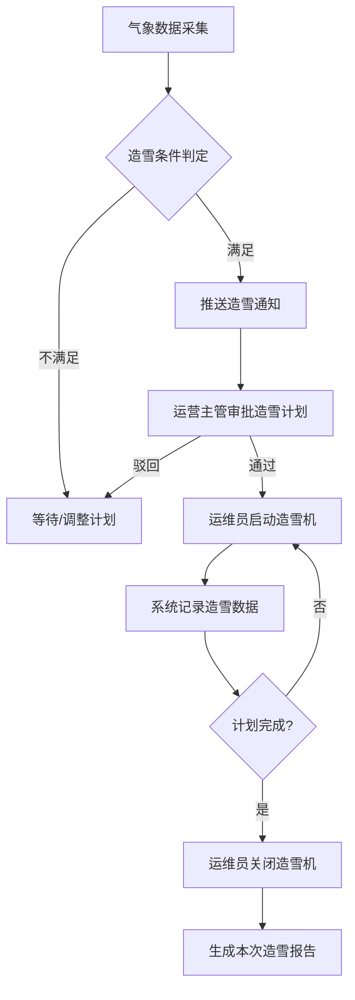
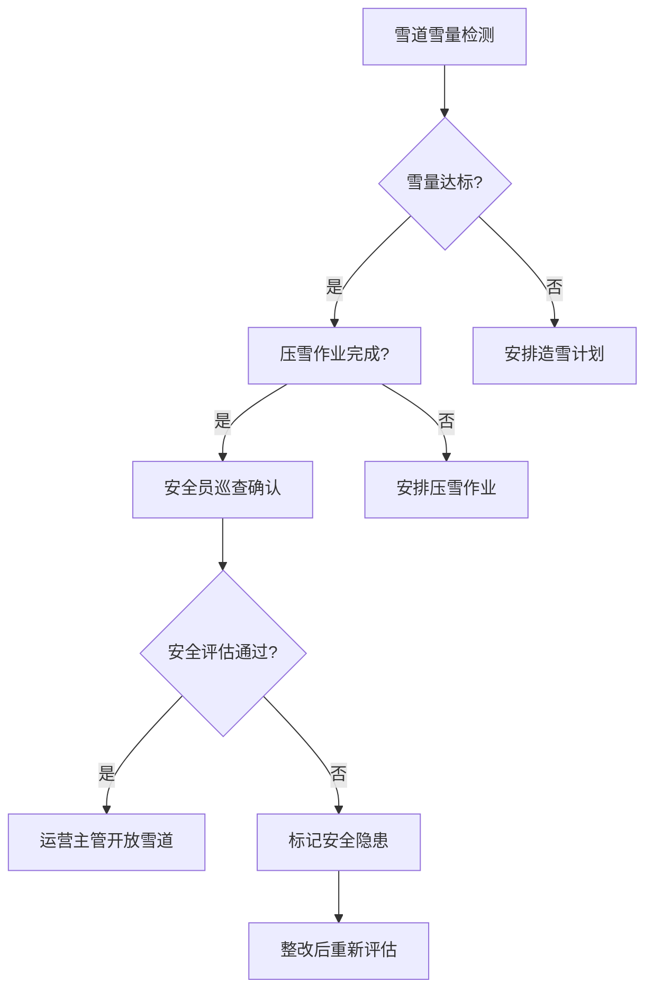
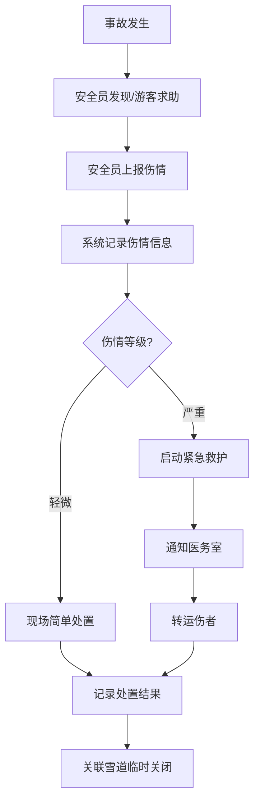

## 1. 产品概述

雪场造雪与雪道管理系统是一款面向滑雪场运营团队的综合管控平台，集成造雪机布点、气象监测、雪道状态、压雪作业、缆车运行、票务核销与安全救护七大核心模块，帮助雪场实现从造雪到运营的全链路数字化管理，提升雪场运营效率与安全水平。

- 目标用户：滑雪场运营管理人员、设备维护人员、安全巡逻人员
- 核心价值：统一管控雪场所有设备与资源，实时监控运营状态，降低安全事故率，优化造雪资源调度

## 2. 核心功能

### 2.1 用户角色

| 角色 | 注册方式 | 核心权限 |
|------|----------|----------|
| 系统管理员 | 后台分配 | 全部模块读写权限、系统配置 |
| 运营主管 | 后台分配 | 造雪计划审批、雪道开关决策、缆车调度 |
| 设备运维员 | 后台分配 | 造雪机操控、压雪车记录、缆车巡检 |
| 安全员 | 后台分配 | 巡逻记录、伤情上报、雪道巡查 |
| 票务员 | 后台分配 | 闸机核销、租赁管理、客流查看 |

### 2.2 功能模块

1. **总览仪表盘**：全局运营数据概览、关键指标实时展示、异常告警汇总
2. **造雪机管理**：造雪机布点地图、设备状态监控、造雪计划排程
3. **气象监测**：温湿度实时监测、造雪条件判定、气象趋势预测
4. **雪道状态**：雪道雪量厚度监测、雪道开放/关闭管理、雪道分级标识
5. **压雪作业**：压雪车作业记录、作业轨迹追踪、作业计划排期
6. **缆车运行**：缆车索道运行监控、运力实时统计、故障告警处理
7. **票务核销**：雪票闸机核销、雪具租赁管理、营收数据统计
8. **安全救护**：滑雪受伤救护记录、安全员巡逻管理、客流统计分析

### 2.3 页面详情

| 页面名称 | 模块名称 | 功能描述 |
|----------|----------|----------|
| 总览仪表盘 | 核心指标卡片 | 今日客流、在运营缆车数、造雪机运行数、雪道开放数 |
| 总览仪表盘 | 运营状态地图 | 雪场俯瞰地图，标注造雪机、缆车、雪道状态 |
| 总览仪表盘 | 告警通知栏 | 设备故障、天气异常、安全事故实时告警 |
| 造雪机管理 | 设备布点地图 | 雪场地图上标注所有造雪机位置与状态 |
| 造雪机管理 | 设备列表 | 造雪机编号、型号、位置、状态、最近造雪时长 |
| 造雪机管理 | 造雪计划排程 | 日历视图排布造雪计划，关联气象条件 |
| 造雪机管理 | 设备详情 | 单台造雪机参数、运行日志、维护记录 |
| 气象监测 | 实时气象面板 | 温度、湿度、风速、降雪量实时数据 |
| 气象监测 | 造雪条件判定 | 根据温湿度自动判定是否满足造雪条件 |
| 气象监测 | 气象趋势图 | 24小时/7天气象数据趋势曲线 |
| 雪道状态 | 雪道列表 | 雪道名称、等级、雪厚、开放状态 |
| 雪道状态 | 雪厚监测图 | 各雪道雪量厚度柱状图/热力图 |
| 雪道状态 | 雪道开关操作 | 一键开放/关闭雪道，记录操作日志 |
| 压雪作业 | 作业记录列表 | 压雪车作业日期、区域、时长、操作员 |
| 压雪作业 | 作业轨迹地图 | 压雪车GPS轨迹回放 |
| 压雪作业 | 作业计划排期 | 压雪作业日历排期 |
| 缆车运行 | 缆车状态面板 | 各缆车/索道运行状态、方向、速度 |
| 缆车运行 | 运力统计 | 各缆车当前运力、累计运载量 |
| 缆车运行 | 故障告警 | 缆车异常停机、超载告警 |
| 票务核销 | 闸机核销记录 | 实时核销流水、时段统计 |
| 票务核销 | 雪具租赁 | 租赁物品管理、在租/归还状态 |
| 票务核销 | 营收统计 | 票务收入、租赁收入汇总图表 |
| 安全救护 | 伤情上报 | 滑雪受伤记录、伤情等级、处置情况 |
| 安全救护 | 巡逻管理 | 安全员巡逻路线、签到打卡、巡逻记录 |
| 安全救护 | 客流统计 | 分时段客流量、雪道客流热力图 |

## 3. 核心流程

### 3.1 造雪作业流程

运营主管根据气象监测数据判断造雪条件，制定造雪计划并排程；系统自动关联温湿度条件，当满足造雪条件时推送通知；运维人员按计划启停造雪机，系统记录造雪时长与产出。

### 3.2 雪道开放关闭流程

### 3.3 安全救护流程

## 4. 用户界面设计

### 4.1 设计风格

- 主色调：冰蓝色 `#0EA5E9`，辅助色：雪白色 `#F0F9FF`，告警色：暖橙色 `#F97316`，危险色：雪红色 `#EF4444`
- 按钮风格：圆角胶囊按钮，主操作实色填充，次要操作描边
- 字体：标题使用 Noto Sans SC Bold，正文使用 Noto Sans SC Regular，数据使用 JetBrains Mono
- 布局：左侧导航栏 + 顶部标题栏 + 主内容区，卡片式布局
- 图标风格：线性图标，线宽1.5px，冰蓝色主题
- 整体风格：冰川科技感，深色背景搭配冰蓝发光效果，营造雪山控制中心的氛围

### 4.2 页面设计概览

| 页面名称 | 模块名称 | UI元素 |
|----------|----------|--------|
| 总览仪表盘 | 核心指标卡片 | 4张数据卡片横排，深色背景冰蓝数字，微光动画 |
| 总览仪表盘 | 运营状态地图 | 雪场2D俯瞰地图，设备图标闪烁状态灯 |
| 总览仪表盘 | 告警通知栏 | 右侧抽屉式告警列表，红/橙/蓝三级颜色 |
| 造雪机管理 | 设备布点地图 | 雪场底图+设备标记点，绿/灰/红三色状态 |
| 造雪机管理 | 设备列表 | 表格+状态标签，行悬浮冰蓝高亮 |
| 造雪机管理 | 造雪计划排程 | 日历网格视图，计划条颜色区分状态 |
| 气象监测 | 实时气象面板 | 大字数字+趋势线图，温度计可视化 |
| 气象监测 | 造雪条件判定 | 环形仪表盘，绿色可造雪/红色不宜 |
| 雪道状态 | 雪道列表 | 卡片网格，雪道等级色带标识 |
| 雪道状态 | 雪厚监测图 | 彩色柱状图+厚度阈值线 |
| 压雪作业 | 作业记录列表 | 表格+操作员头像标签 |
| 压雪作业 | 作业轨迹地图 | 地图+折线轨迹回放 |
| 缆车运行 | 缆车状态面板 | 缆车示意图+运行方向动画箭头 |
| 票务核销 | 闸机核销记录 | 实时流水表+时段柱状图 |
| 票务核销 | 雪具租赁 | 卡片式物品管理，在租/库存双色标识 |
| 安全救护 | 伤情上报 | 表单+伤情等级色标选择 |
| 安全救护 | 客流统计 | 分时段折线图+热力图 |

### 4.3 响应式设计

- 桌面优先设计，最小支持1280px宽度
- 左侧导航栏可折叠为图标模式
- 数据卡片在窄屏下自动换行
- 地图模块保持固定宽高比

### 4.4 3D场景指引

本项目不涉及3D场景。
