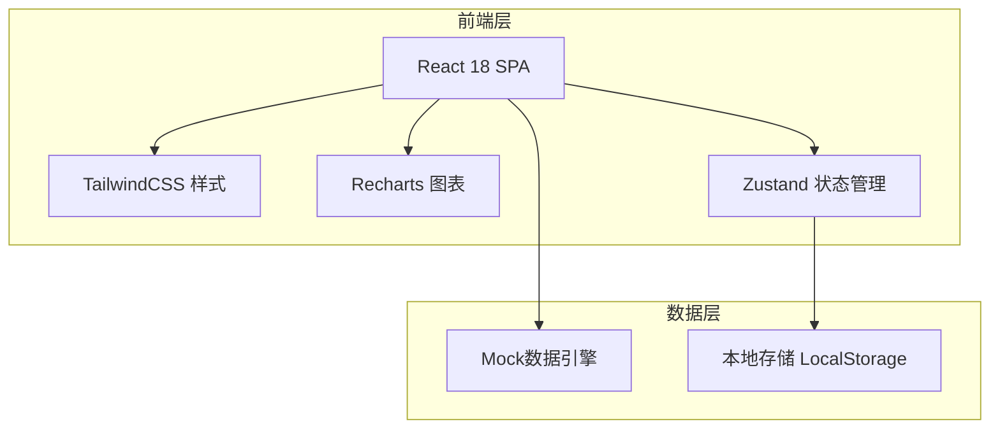
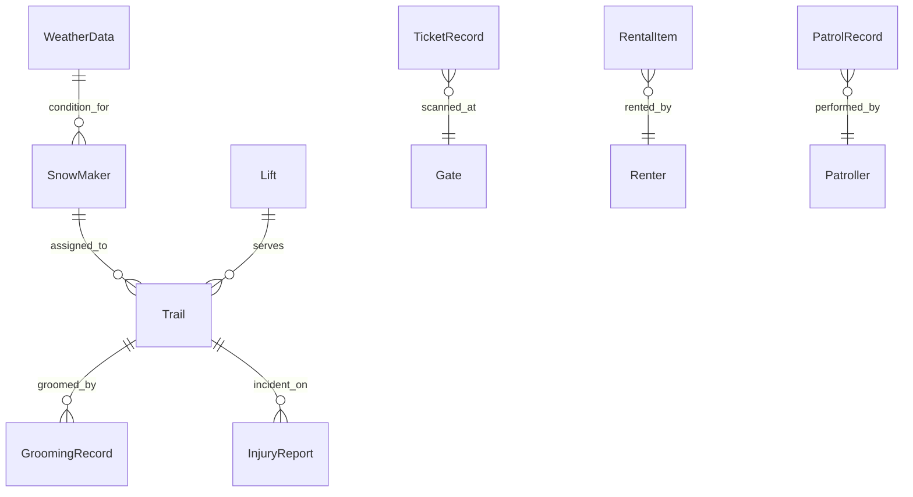

## 1. 架构设计



## 2. 技术说明

- 前端：React@18 + TailwindCSS@3 + Vite
- 初始化工具：Vite（React + TypeScript 模板）
- 图表库：Recharts（轻量级React图表）
- 状态管理：Zustand
- 后端：无（纯前端，Mock数据）
- 数据库：无（LocalStorage持久化 + 内存Mock数据）

## 3. 路由定义

| 路由 | 用途 |
|------|------|
| / | 总览仪表盘，全局运营数据概览 |
| /snowmaker | 造雪机管理，设备布点、状态、排程 |
| /weather | 气象监测，温湿度、造雪条件、趋势 |
| /trail | 雪道状态，雪量厚度、开关管理 |
| /grooming | 压雪作业，作业记录、轨迹、排期 |
| /lift | 缆车运行，运行监控、运力、告警 |
| /ticket | 票务核销，闸机核销、租赁、营收 |
| /safety | 安全救护，伤情上报、巡逻、客流 |

## 4. API定义

本项目为纯前端应用，使用Mock数据。核心数据类型定义如下：

```typescript
interface SnowMaker {
  id: string;
  name: string;
  model: string;
  position: { x: number; y: number };
  status: "running" | "idle" | "fault" | "maintain";
  trail: string;
  lastRunHours: number;
  totalOutput: number;
}

interface WeatherData {
  timestamp: string;
  temperature: number;
  humidity: number;
  windSpeed: number;
  snowfall: number;
  canMakeSnow: boolean;
}

interface Trail {
  id: string;
  name: string;
  level: "beginner" | "intermediate" | "advanced" | "expert";
  snowDepth: number;
  status: "open" | "closed" | "grooming";
  length: number;
}

interface GroomingRecord {
  id: string;
  date: string;
  trail: string;
  operator: string;
  duration: number;
  status: "completed" | "in_progress" | "planned";
}

interface Lift {
  id: string;
  name: string;
  type: "cable_car" | "chairlift" | "magic_carpet";
  status: "running" | "stopped" | "maintenance";
  capacity: number;
  currentLoad: number;
  direction: "up" | "down";
}

interface TicketRecord {
  id: string;
  type: "full_day" | "half_day" | "hour";
  timestamp: string;
  gate: string;
  status: "valid" | "used" | "expired";
}

interface RentalItem {
  id: string;
  type: "ski" | "snowboard" | "helmet" | "suit";
  status: "available" | "rented" | "maintenance";
  renter?: string;
}

interface InjuryReport {
  id: string;
  timestamp: string;
  trail: string;
  level: "minor" | "moderate" | "severe";
  description: string;
  handler: string;
  status: "pending" | "treating" | "resolved";
}

interface PatrolRecord {
  id: string;
  patroller: string;
  route: string;
  startTime: string;
  endTime?: string;
  checkpoints: string[];
  status: "active" | "completed";
}
```

## 5. 服务端架构

本项目无后端服务。

## 6. 数据模型

### 6.1 数据模型定义



### 6.2 数据定义语言

本项目使用内存Mock数据 + LocalStorage持久化，无需DDL语句。Mock数据在应用启动时自动生成。
